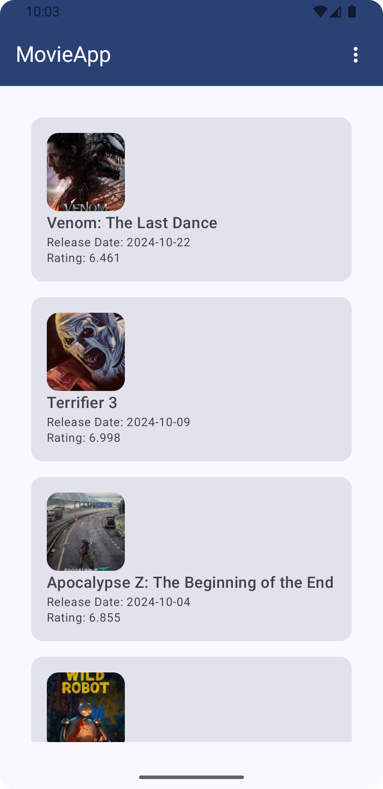
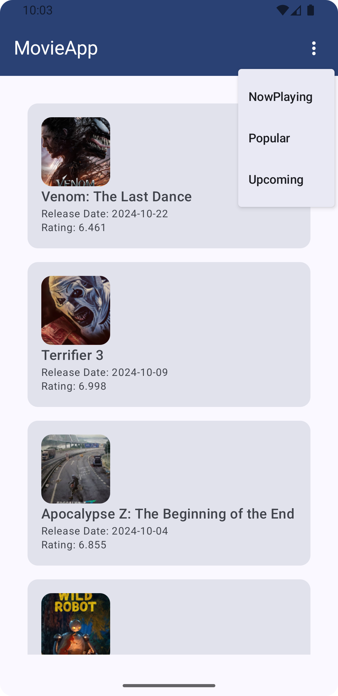
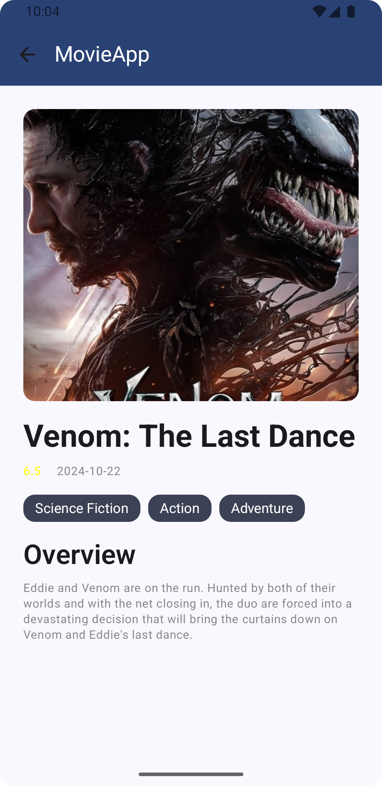

🎬 MovieApp

MovieApp is a clean, modern Android application built to showcase popular movies and movie details. It features a clean UI, supports offline caching, and uses modern Android development practices with Kotlin, Jetpack Compose, and a robust architecture.

📱 Screenshots





🚀 Features

	•	Popular Movies List: Browse popular movies with title, rating, release date, and genres.
	•	Movie Details: View detailed information about a movie, including an image, overview, and additional details.
	•	Offline Caching: Supports offline access with caching for enhanced user experience.
	•	Dynamic Filtering: Filter movies by categories like Now Playing, Popular, and Upcoming.
	•	Pagination: Efficiently loads large movie lists with seamless pagination.

🛠 Tech Stack

	•	Kotlin: All code written in Kotlin for safety and conciseness.
	•	Jetpack Compose: Modern UI toolkit for building native Android interfaces with declarative Kotlin code.
	•	Room Database: Local database for offline caching of movie data.
	•	Retrofit & OkHttp: Network libraries for API calls to fetch movie data.
	•	Dagger Hilt: Dependency injection to manage and provide dependencies across the app.
	•	Coroutines & Flow: Asynchronous programming for smooth and responsive UI.
	•	Coil: Image loading library optimized for Android Compose.
	•	JUnit & MockK: Testing framework for unit testing.

🏗️ Architecture

This app follows MVVM (Model-View-ViewModel) architecture, leveraging MVI (Model-View-Intent) pattern for state management and handling user events effectively.

Layers

	•	UI Layer (Jetpack Compose): Presents the UI using Compose and reflects the state from ViewModel. Screens like Movies List and Movie Details utilize Composables to display data.
	•	Domain Layer: Contains UseCases and business logic, isolating the core functionality from other app layers.
	•	Data Layer: Handles data sources, including the Room database for local storage and Retrofit for remote data access.

Flow

	1.	ViewModel: Handles user interactions and fetches data from UseCases based on UI events.
	2.	UseCases: Coordinate interactions between the ViewModel and repository, managing caching and network operations.
	3.	Repository: Acts as a single source of truth, mediating between remote (API) and local (Room) data sources.
	4.	Networking: Uses Retrofit and OkHttp with a custom interceptor to inject the API key into every request.

Key Classes

	•	MoviesListViewModel: Manages the state of the movies list screen and handles pagination.
	•	MovieDetailsViewModel: Manages the details for a single movie.
	•	ApiKeyInterceptor: Injects the API key automatically into every API request.
	•	Converters: TypeConverters to handle complex data types in Room, such as lists.

📦 Project Structure

├── data
│   ├── datasource            # Whether it's local or remote
│   ├── repository          # Repository for data management
├── domain
│   ├── model               # Domain models
│   ├── usecase             # UseCases for business logic
├── ui
│   ├── components          # Reusable Composables
├── di                      # Dagger Hilt modules for dependency injection
└── utils                   # Utility classes

📲 Getting Started

To get a local copy up and running, follow these simple steps.

Prerequisites

	1.	Obtain an API key from [TMDB](https://example.com).
	2.	Add the API key in your local.properties file:

```properties
 TMDB_API_KEY=your_api_key_here
 BaseURL = https://api.themoviedb.org/3/
 ImageBaseURL = https://image.tmdb.org/t/p/w500

📧 Contact

[My LinkedIn Profile](https://www.linkedin.com/in/maymanm/)


